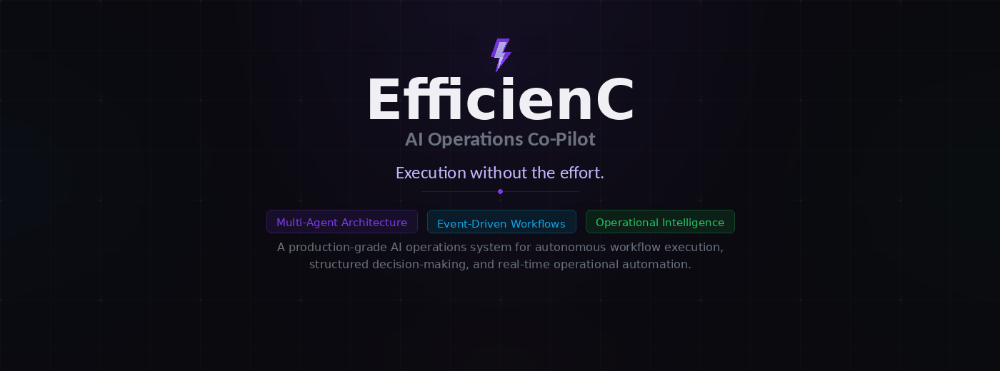
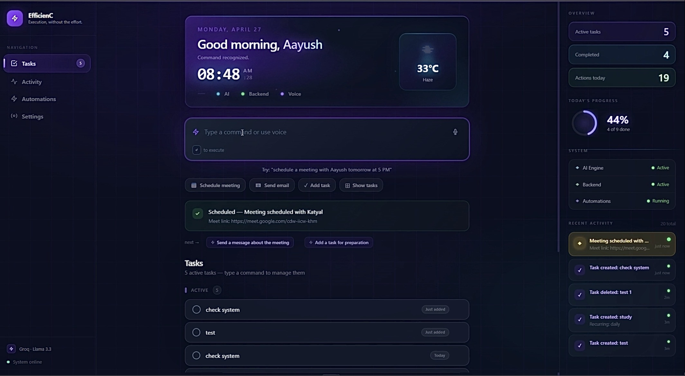

<p align="center">
  
</p>

<p align="center"> <a href="#system-architecture"><strong>Architecture</strong></a> &nbsp;&nbsp;•&nbsp;&nbsp; <a href="#current-features"><strong>Features</strong></a> &nbsp;&nbsp;•&nbsp;&nbsp; <a href="#agent-pipeline"><strong>Agent Pipeline</strong></a> &nbsp;&nbsp;•&nbsp;&nbsp; <a href="#getting-started"><strong>Get Started</strong></a> &nbsp;&nbsp;•&nbsp;&nbsp; <a href="#future-roadmap"><strong>Roadmap</strong></a> </p>

### What This System Does

EfficienC is not a chatbot. It is a deterministic multi-agent execution pipeline that converts natural language into real-world actions — scheduling meetings, sending emails, managing tasks, and triggering reminders — through a structured chain of AI planning, rule-based decision-making, validation, and execution.

<div align="center">

| Capability | Description |
|:---|:---|
| **Workflow Orchestration** | Multi-agent pipeline: Planner → Decision → Supervisor → Execution |
| **Operational Automation** | Google Calendar, Gmail, task management, reminder engine |
| **Intelligent Planning** | LLM-based intent parsing into structured JSON actions |
| **Execution Governance** | Rule-based validation layer blocks invalid or incomplete actions |
| **Event-Driven Architecture** | Background scheduling, time-aware triggers, autonomous reminders |

</div>

<p align="center">
  <sub>
     &nbsp;
     &nbsp;
     &nbsp;
    
  </sub>
</p>

# Screenshots

## Dashboard

<p align="center">
  
</p>

<p align="center">
  <sub>
    Real-time operational dashboard with multi-agent orchestration, workflow execution, task lifecycle tracking, SSE updates, and automation monitoring.
  </sub>
</p>

---

# Overview

EfficienC is an enterprise inspired AI Operations Co Pilot designed to automate operational workflows through controlled multi agent orchestration, structured reasoning pipelines, and deterministic execution systems.

Unlike conventional AI assistants that rely heavily on unrestricted generative behavior, EfficienC follows a production oriented architecture where intelligence and execution are intentionally separated.

The platform is engineered around the philosophy that:

> AI should reason intelligently, but systems should execute predictably.

Every workflow inside EfficienC follows a governed lifecycle:

```text
Input → Understanding → Decision → Validation → Execution → Logging
```

This creates an operational environment that is:

• predictable under scale
• modular in architecture
• observable in execution
• extensible for integrations
• safe for automation workflows

---

## What Makes EfficienC Different

### Controlled AI Infrastructure

The AI layer is responsible only for:

• reasoning
• intent extraction
• contextual understanding
• structured decision making

The AI layer is NOT allowed to:

• directly execute actions
• bypass validation
• control workflow state
• trigger unsafe operations

This separation creates a production style governance model similar to modern enterprise automation platforms.

---

## Enterprise Style Operational Flow

EfficienC combines:

| Capability                   | Purpose                               |
| ---------------------------- | ------------------------------------- |
| Multi Agent Orchestration    | Structured workflow management        |
| Event Driven Scheduling      | Real time execution lifecycle         |
| Operational Validation Layer | Safe execution enforcement            |
| SSE Infrastructure           | Real time frontend synchronization    |
| Notion Integration           | Persistent workflow memory            |
| Structured JSON Contracts    | Predictable inter agent communication |
| Logging Infrastructure       | Traceability and observability        |
| Modular Architecture         | Scalability and maintainability       |

---

## Architectural Philosophy

The system is intentionally designed like an internal operational platform rather than a chatbot.

This means:

• workflows are deterministic
• validation is mandatory
• execution is isolated
• infrastructure is event driven
• agents are responsibility specific
• outputs are structured and traceable

The result is a system that feels closer to a lightweight operational SaaS platform than a traditional AI demo.

---

# Core Vision

The goal of EfficienC is to simulate how modern internal operational systems function inside scalable organizations.

The system focuses on:

• Reliable automation over unpredictable generation
• Structured workflows over free form agents
• Validation before execution
• Separation of reasoning and action
• Modular and scalable architecture
• Real world operational utility

---

# Key Highlights

## Multi Agent Architecture

EfficienC is built using specialized agents where every agent has a dedicated responsibility.

Input Agent → Decision Agent → Supervisor Agent → Execution Agent

This separation ensures:

• controlled execution
• modularity
• safer automation
• predictable outputs
• simplified debugging
• scalable workflows

---

## Real Time Reminder Engine

The platform includes a fully event driven scheduling system capable of:

• task scheduling
• reminder execution
• notification dispatching
• SSE based real time updates
• lifecycle tracking
• external synchronization

---

## Notion Synchronization

Tasks created inside the system automatically synchronize with Notion.

Lifecycle states are updated dynamically:

• pending
• in_progress
• completed

This creates a persistent operational memory layer for workflows.

---

## AI Assisted Workflow Understanding

The system processes natural language requests and converts them into structured executable actions.

Example:

```text
"Remind me to submit the deployment report at 9 PM"
```

Transforms into:

```json
{
  "type": "create_task",
  "task": "submit deployment report",
  "dueTime": "9 PM"
}
```

---

## Controlled AI Execution

EfficienC intentionally prevents unrestricted AI behavior.

The LLM:

• cannot directly execute actions
• cannot bypass validation
• cannot modify workflow control
• cannot perform unsafe operations

This creates a production style governance layer.

---

# System Architecture

```text
User Input
     ↓
Input Agent
     ↓
Decision Agent
     ↓
Supervisor Agent
     ↓
Execution Agent
     ↓
Scheduler + Event System
     ↓
Notification + External Sync
     ↓
Logging + Persistence
```

---

# Agent Architecture

## Input Agent

Responsible for:

• intent extraction
• entity recognition
• structured understanding
• contextual parsing

### Output Example

```json
{
  "intent": "create_task",
  "entities": {
    "task": "prepare report"
  },
  "confidence": 0.96
}
```

---

## Decision Agent

Responsible for:

• workflow determination
• operational reasoning
• action selection
• priority analysis

### Allowed Actions

• reply
• schedule
• create_task
• escalate

---

## Supervisor Agent

Responsible for:

• validation
• safety checks
• workflow approval
• execution gating

### Validation Rules

• required data exists
• action is valid
• workflow is safe
• execution is authorized

---

## Execution Agent

Responsible for:

• executing approved actions
• workflow triggering
• task creation
• scheduler registration
• external synchronization

---

# Technical Architecture

## Frontend

• React
• Framer Motion
• Real time UI updates
• Event driven notifications
• SSE integration
• Animated operational dashboard

---

## Backend

• Node.js
• Express
• Event driven scheduler
• Structured orchestration pipeline
• Modular services architecture

---

## Database & Persistence

• MongoDB
• Notion API Integration
• Persistent workflow tracking

---

## AI Layer

Currently integrated:

• Groq Llama 3.3

Planned support:

• OpenAI
• Claude
• Gemini
• local models

---

## Automation Layer

• Event driven scheduler
• Real time notifications
• task orchestration
• workflow lifecycle management

---

# Current Features

## Intelligent Task Creation

Natural language task creation with automated parsing.

---

## Real Time Reminders

Custom notification engine with:

• animated toasts
• sound alerts
• lifecycle tracking
• browser event synchronization

---

## SSE Based Live Updates

The frontend receives real time backend events through Server Sent Events.

---

## Operational Logging

Every workflow step is logged for:

• traceability
• debugging
• system reliability

---

## Notion Workflow Sync

Tasks automatically sync to Notion databases with dynamic status updates.

---

## Structured JSON Workflow System

All agents communicate strictly using structured outputs.

No uncontrolled free form execution exists inside the architecture.

---

# Example Workflow

## User Request

```text
Remind me to go to the gym in 2 hours
```

---

## Pipeline Execution

### 1. Input Agent

```json
{
  "intent": "create_task",
  "entities": {
    "task": "go to the gym",
    "time": "2 hours"
  }
}
```

---

### 2. Decision Agent

```json
{
  "action": "schedule",
  "priority": "normal"
}
```

---

### 3. Supervisor Agent

```json
{
  "approved": true
}
```

---

### 4. Execution Agent

• creates task
• registers scheduler
• syncs Notion
• logs workflow
• dispatches notification event

---

# Reliability Principles

## Validation First

No workflow executes without validation.

---

## Deterministic Pipelines

No uncontrolled loops or recursive agent execution.

---

## Separation of Concerns

AI handles reasoning.
Execution handles actions.

---

## Extensible Architecture

The system is modular and built for future integrations.

---

# Project Structure

```text
EfficienC-automation-agent/
│
├── efficienC-ui/
│   ├── src/
│   ├── components/
│   ├── animations/
│   └── notification system
│
├── src/
│   ├── agents/
│   ├── automation/
│   ├── integrations/
│   ├── utils/
│   ├── orchestrator/
│   └── scheduler/
│
├── PRD.md
├── Architecture.md
├── Workflows.md
├── Agents.md
├── Tech_Stack.md
└── walkthrough.md
```

---

# Setup Instructions

## Clone Repository

```bash
git clone <your-repository-url>
cd EfficienC-automation-agent
```

---

## Install Dependencies

```bash
npm install
```

---

## Configure Environment Variables

Create a `.env` file:

```env
PORT=5000
MONGO_URI=your_mongodb_uri
GROQ_API_KEY=your_groq_key
NOTION_TOKEN=your_notion_token
NOTION_DATABASE_ID=your_database_id
```

---

## Start Backend

```bash
node src/server.js
```

---

## Start Frontend

```bash
cd efficienC-ui
npm install
npm run dev
```

---

# Operational Design Principles

## No AI Direct Execution

LLMs cannot directly trigger actions.

---

## Validation Before Execution

Every action passes through supervisor validation.

---

## Structured Agent Contracts

All agents communicate through JSON.

---

## Event Driven Infrastructure

Schedulers and notifications operate independently of AI.

---

# Future Roadmap

## Phase 2

• AI query layer
• operational analytics
• contextual workflow memory
• workflow summarization
• intelligent recommendations
• persistent workflow history

---

## Phase 3

• Gmail integration
• Slack integration
• calendar orchestration
• automated escalation systems
• workflow dashboards
• multi user support

---

## Phase 4

• RAG based operational memory
• vector search
• autonomous workflow planning
• intelligent prioritization
• predictive operational analysis

---

# Why This Project Matters

EfficienC is not a generic AI demo.

It represents a production inspired operational system that demonstrates:

• multi agent architecture
• controlled AI governance
• workflow orchestration
• real time infrastructure
• external integrations
• scalable backend design
• event driven systems
• operational automation

The project focuses on building AI systems that are:

• reliable
• explainable
• structured
• extensible
• enterprise oriented

---

# Screenshots

Add screenshots here:

```text
/dashboard
/notifications
/notion-sync
/workflow-execution
```

---

# Author

## Aayush Katyal

Focused on:

• AI Systems
• Multi Agent Architectures
• Workflow Automation
• Backend Engineering
• Intelligent Operations Platforms

---

# License

MIT License

---

# Final Note

EfficienC was built with the philosophy that AI systems should not only generate responses, but should reliably execute structured operational workflows.

This project explores the intersection of:

• intelligent reasoning
• deterministic execution
• operational reliability
• real world automation

while maintaining architectural clarity and production inspired engineering principles.
